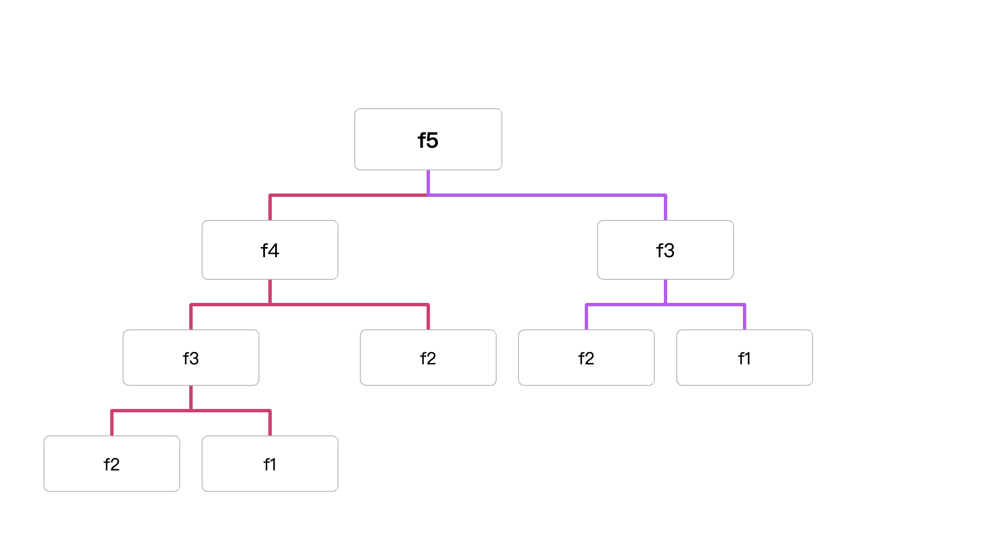

### **[70. 爬楼梯](https://leetcode.cn/problems/climbing-stairs/)**

假设你正在爬楼梯。需要 `n` 阶你才能到达楼顶。

每次你可以爬 `1` 或 `2` 个台阶。你有多少种不同的方法可以爬到楼顶呢？

| n步数到顶层 | 先走一步 | 先走两步 | 共多少种 | 总结 |
| --- | --- | --- | --- | --- |
| 1 | 1 | 0 | 1 | if f(1) return 1 |
| 2 | 1+1 | 2 | 2 | if f(2) return 2 |
| 3 | 1+1+1，1+2 | 2+1 | 3 | f3=f(3-1)+f(3-2)=3 |
| 4 | 1+1+1+1，1+1+2，1+2+1 | 2+1+1，2+2 | 5 | f4=f(4-1)+f(4-2)=5 |
| 5 | 1+1+1+1+1，1+1+1+2，1+1+2+1，1+2+1+1 | 2+1+1+1，2+2+1，2+1+2，1+2+2 | 8 | f5=f(5-1)+f(5-2) = 8 |
| n | f(n-1) | f(n-2) | n | fn=f(n-1)+f(n-2) |

*推导：* `第n步 就等于f(n-1)+f(n-2) ⇒ 假设n=5 ⇒ f(5-1)+f(5-2) ⇒f(4)+f(3) ⇒步数为4层的有5种办法+步数为3层的有3种办法 ⇒ 5+3 ⇒ 8 ⇒ 如果5步可以到达顶层有8种不同的方法`



#### 递归

- js

```jsx
/**
 * 递归
 * @param {number} n
 * @return {number}
 */
var climbStairs = function (n) {
  if (n === 1) return 1;
  if (n === 2) return 2;

  return climbStairs(n - 1) + climbStairs(n - 2);
};

console.log(climbStairs(5));
```

如果数值过大，递归会消耗大量的时间，会有超时问题

#### 递归+map

- js

```jsx
/**
 * 递归+map
 * @param {number} n
 * @return {number}
 */
var climbStairs = function (n) {
    const map = new Map();
    const func = (n) =>{
        if (n === 1) return 1;
        if (n === 2) return 2;
        if(map.get(n)){
            return map.get(n)
        }else{
            const result = func(n-1)+func(n-2)
            map.set(n,result)
            return result
        }
    }
    return func(n)
  };
```

- go

```go
func climbStairs(n int) int {
     m := map[int]int{}

     var sum func(n int) int
     sum = func (n int) int{
         if n ==1 {
             return 1
         }
         if n ==2 {
             return 2
         }
         if val,ok := m[n]; ok{
             return val
         }else{
             result := sum(n-1)+sum(n-2)
             m[n] = result
             return result
         }
     }
     return sum(n)
}
```

#### 循环

- js

```jsx
/**
 * 循环
 * @param {number} n
 * @return {number}
 */
var climbStairs = function (n) {
  if (n === 1) return 1;
  if (n === 2) return 2;
  let result = 0;
  let n1 = 1;
  let n2 = 2;

  for (let i = 3; i <= n; i++) {
    result = n1 + n2;
    n1 = n2;
    n2 = result;
  }
  return result;
};
console.log(climbStairs(5));
```

- go

```go
func climbStairs(n int) int {
    if n==1 {
        return 1
    }
    if n==2 {
        return 2
    }
    result := 0
    n1 :=1
    n2 :=2
    for i :=3; i<=n;i++ {
        result = n1+n2
        n1 = n2
        n2 = result
    }
    return result
}
```