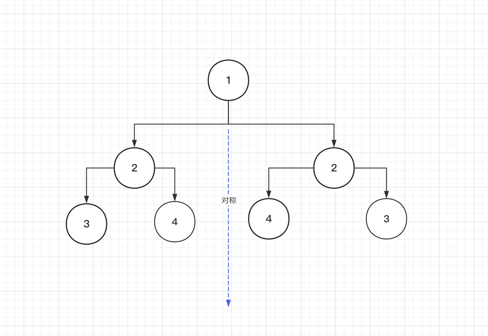

### **[101. 对称二叉树](https://leetcode.cn/problems/symmetric-tree/)**

`难度：简单`

给你一个二叉树的根节点 `root` ， 检查它是否轴对称。



```bash
输入：root = [1,2,2,3,4,4,3]
输出：true
```

- javascript

```jsx
/**
 * Definition for a binary tree node.
 * function TreeNode(val, left, right) {
 *     this.val = (val===undefined ? 0 : val)
 *     this.left = (left===undefined ? null : left)
 *     this.right = (right===undefined ? null : right)
 * }
 */
/**
 * @param {TreeNode} root
 * @return {boolean}
 */
var isSymmetric = function(root) {
    if(!root) return true

    const dfs = (left,right) =>{
        if(left!==null&&right === null) return false
        else if(left===null&&right!==null) return false
        else if (left === null && right === null) return true
        else if(left.val !== right.val) return false
        return dfs(left.left,right.right) && dfs(left.right,right.left)
        
    }
    return dfs(root.left,root.right)
};
```

- golang

```jsx
/**
 * Definition for a binary tree node.
 * type TreeNode struct {
 *     Val int
 *     Left *TreeNode
 *     Right *TreeNode
 * }
 */
func isSymmetric(root *TreeNode) bool {
    if root == nil {
        return true
    }
    var dfs func(left *TreeNode, right *TreeNode) bool
    dfs = func(left *TreeNode, right *TreeNode) bool {
        if left !=nil && right == nil {
            return false
        } else if left ==nil && right !=nil {
            return false
        } else if left == nil && right == nil {
            return true
        } else if left.Val != right.Val {
            return false
        }
        return dfs(left.Left,right.Right) && dfs(left.Right,right.Left)
    }

    return dfs(root.Left,root.Right)
}
```