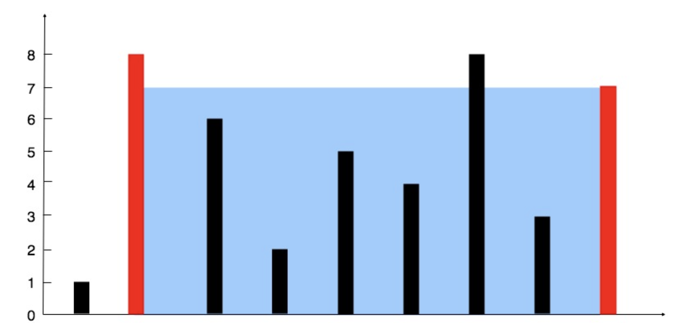

### **[11. 盛最多水的容器](https://leetcode.cn/problems/container-with-most-water/)**

给定一个长度为 `n` 的整数数组 `height` 。有 `n` 条垂线，第 `i` 条线的两个端点是 `(i, 0)` 和 `(i, height[i])` 。

找出其中的两条线，使得它们与 `x` 轴共同构成的容器可以容纳最多的水。

返回容器可以储存的最大水量。

说明：你不能倾斜容器。

**示例 1：**



```go
输入：[1,8,6,2,5,4,8,3,7]
输出：49 
解释：图中垂直线代表输入数组 [1,8,6,2,5,4,8,3,7]。在此情况下，容器能够容纳水（表示为蓝色部分）的最大值为 49。
```

**示例 2：**

```go
输入：height = [1,1]
输出：1
```

- TypeScript

```go
function maxArea(height: number[]): number {
    let l = 0,r = height.length - 1, ans = 0;
    while (l < r) {
        const area = Math.min(height[l],height[r]) * (r - l)
        ans = Math.max(ans,area)
        if(height[l] <= height[r]){
            l++
        }else{
            r--
        }
    }
    return ans
};
```

- Go

```go
func min(a, b int)int {
    if a < b {
        return a
    }
    return b
}
func max(a, b int)int {
    if a > b {
        return a
    }
    return b
}
func maxArea(height []int) int {
    l := 0;
    r := len(height) - 1;
    ans := 0;

    for l < r {
        area := min(height[l],height[r]) * (r - l)
        ans = max(ans,area)
        if height[l] <= height[r] {
            l++
        }else {
            r--
        }
    }
    return ans
}
```