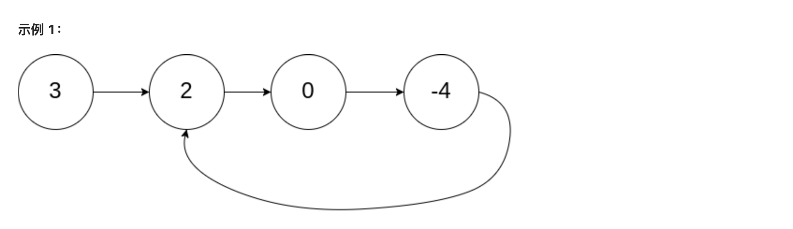

### **[141. 环形链表](https://leetcode.cn/problems/linked-list-cycle/)**

给你一个链表的头节点 `head` ，判断链表中是否有环。

如果链表中有某个节点，可以通过连续跟踪 `next` 指针再次到达，则链表中存在环。 为了表示给定链表中的环，评测系统内部使用整数 `pos` 来表示链表尾连接到链表中的位置（索引从 0 开始）。**注意：`pos` 不作为参数进行传递** 。仅仅是为了标识链表的实际情况。

*如果链表中存在环* ，则返回 `true` 。 否则，返回 `false` 。




```jsx
输入：head = [3,2,0,-4], pos = 1
输出：true
解释：链表中有一个环，其尾部连接到第二个节点。
```

- go

```jsx
/**
 * Definition for singly-linked list.
 * type ListNode struct {
 *     Val int
 *     Next *ListNode
 * }
 */
func hasCycle(head *ListNode) bool {
      a := head
      b := head
      
      for b!=nil && b.Next!=nil {
          a = a.Next
          b = b.Next.Next
          if a == b {
              return true
          }
      }
      return false
}
```

- js

```jsx
/**
 * Definition for singly-linked list.
 * function ListNode(val) {
 *     this.val = val;
 *     this.next = null;
 * }
 */

/**
 * @param {ListNode} head
 * @return {boolean}
 */
var hasCycle = function(head) {
    let a = head,b = head;
    
    while(b!==null && b.next!==null){
        a = a.next
        b = b.next.next
        if (a === b) return true
    }
    return false
};
```

