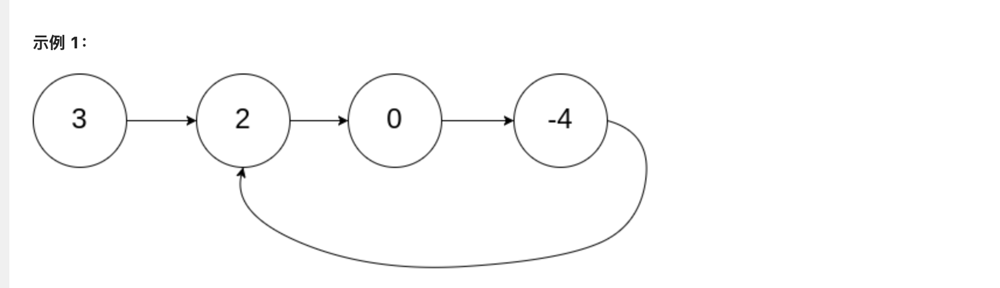

### **[142. 环形链表 II](https://leetcode.cn/problems/linked-list-cycle-ii/)**

给定一个链表的头节点  `head` ，返回链表开始入环的第一个节点。 *如果链表无环，则返回 `null`。*

如果链表中有某个节点，可以通过连续跟踪 `next` 指针再次到达，则链表中存在环。 为了表示给定链表中的环，评测系统内部使用整数 `pos` 来表示链表尾连接到链表中的位置（**索引从 0 开始**）。如果 `pos` 是 `-1`，则在该链表中没有环。**注意：`pos` 不作为参数进行传递**，仅仅是为了标识链表的实际情况。

**不允许修改** 链表。



```jsx
输入：head = [3,2,0,-4], pos = 1
输出：返回索引为 1 的链表节点
解释：链表中有一个环，其尾部连接到第二个节点。
```

- js

```jsx
function ListNode(val) {
  this.val = val;
  this.next = null;
}
/**
 * @param {ListNode} head
 * @return {ListNode}
 */
var detectCycle = function (head) {
   
    // let p = head
    s = new Set()
    while(head!=null){
      if(s.has(head)){
        return head
      }
      s.add(head)
      head = head.next
    }

    return null
};

const list = new ListNode(3);
list.next = new ListNode(2);
list.next.next = new ListNode(0);
list.next.next.next = new ListNode(-4);
list.next.next.next.next = list.next
console.log(detectCycle(list))
```

- go

```go
package main

import "fmt"

type ListNode struct {
	Val  int
	Next *ListNode
}

func detectCycle(head *ListNode) *ListNode {

	m := make(map[*ListNode]bool)

	for head != nil {
		if _, ok := m[head]; ok {
			return head
		}
		m[head] = true
		head = head.Next
	}
	return nil
}

func main() {
	list := &ListNode{Val: 3}
	list.Next = &ListNode{Val: 2}
	list.Next.Next = &ListNode{Val: 0}
	list.Next.Next.Next = &ListNode{Val: -4}
	list.Next.Next.Next.Next = list.Next
	res := detectCycle(list)
	fmt.Printf("res:=%v", res.Val)
}
```