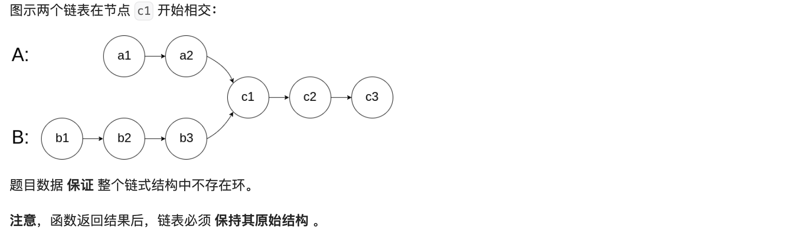
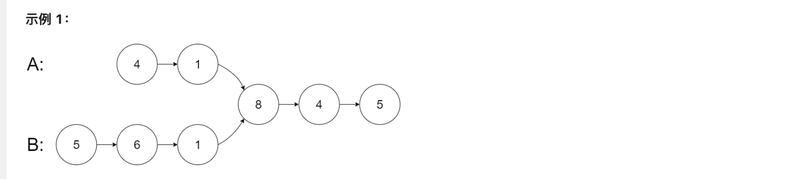

### **[160. 相交链表](https://leetcode.cn/problems/intersection-of-two-linked-lists/)**

给你两个单链表的头节点 `headA` 和 `headB` ，请你找出并返回两个单链表相交的起始节点。如果两个链表不存在相交节点，返回 `null` 。




```go
输入：intersectVal = 8, listA = [4,1,8,4,5], listB = [5,6,1,8,4,5], skipA = 2, skipB = 3
输出：Intersected at '8'
解释：相交节点的值为 8 （注意，如果两个链表相交则不能为 0）。
从各自的表头开始算起，链表 A 为 [4,1,8,4,5]，链表 B 为 [5,6,1,8,4,5]。
在 A 中，相交节点前有 2 个节点；在 B 中，相交节点前有 3 个节点。
— 请注意相交节点的值不为 1，因为在链表 A 和链表 B 之中值为 1 的节点 (A 中第二个节点和 B 中第三个节点) 是不同的节点。换句话说，它们在内存中指向两个不同的位置，而链表 A 和链表 B 中值为 8 的节点 (A 中第三个节点，B 中第四个节点) 在内存中指向相同的位置。
```

- js

```jsx
/**
 * 输入：intersectVal = 8, listA = [4,1,8,4,5], listB = [5,6,1,8,4,5], skipA = 2, skipB = 3
   输出：Intersected at '8'
 * Definition for singly-linked list.
 * function ListNode(val) {
 *     this.val = val;
 *     this.next = null;
 * }
 */
function ListNode(val) {
  this.val = val;
  this.next = null;
}
/**
 * @param {ListNode} headA
 * @param {ListNode} headB
 * @return {ListNode}
 */
var getIntersectionNode = function (headA, headB) {
    
    console.log(headA, headB)
    let nodeSet = new Set()
    while(headA !=null){
        nodeSet.add(headA)
        headA = headA.next
    }

    console.log(nodeSet)
    while(headB !=null){
        if(nodeSet.has(headB)){
            return headB
        }
        headB = headB.next
    }

};

l3 = new ListNode(8)
l3.next = new ListNode(4)
l3.next.next = new ListNode(5)

l1 = new ListNode(4)
l1.next = new ListNode(1)
l1.next.next = l3
l1.next.next.next = l3.next
l1.next.next.next.next = l3.next.next
l2  = new ListNode(5)
l2.next  = new ListNode(6)
l2.next.next  = new ListNode(1)
l2.next.next.next  = l3
l2.next.next.next.next  = l3.next
l2.next.next.next.next.next  =l3.next.next
console.log(getIntersectionNode(l1,l2))
```

- go

```go
package main

import "fmt"

type ListNode struct {
	Val  int
	Next *ListNode
}

/**
 * Definition for singly-linked list.
 * type ListNode struct {
 *     Val int
 *     Next *ListNode
 * }
 */
func getIntersectionNode(headA, headB *ListNode) *ListNode {

	nodeSet := make(map[*ListNode]bool)

	for headA != nil {
		nodeSet[headA] = true
		headA = headA.Next
	}

	for headB != nil {
		if _, ok := nodeSet[headB]; ok {
			return headB
		}
		headB = headB.Next
	}

	return nil

}

func main() {
	l3 := &ListNode{Val: 8}
	l3.Next = &ListNode{Val: 4}
	l3.Next.Next = &ListNode{Val: 5}

	l1 := &ListNode{Val: 4}
	l1.Next = &ListNode{Val: 1}
	l1.Next.Next = l3
	l1.Next.Next.Next = l3.Next
	l1.Next.Next.Next.Next = l3.Next.Next

	l2 := &ListNode{Val: 5}
	l2.Next = &ListNode{Val: 6}
	l2.Next.Next = &ListNode{Val: 1}
	l2.Next.Next.Next = l3
	l2.Next.Next.Next.Next = l3.Next
	l2.Next.Next.Next.Next.Next = l3.Next.Next

	res := getIntersectionNode(l1, l2)
	fmt.Println(res.Val)
}
```