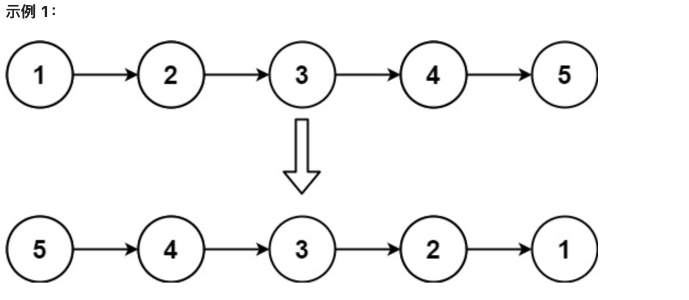

### **[206. 反转链表](https://leetcode.cn/problems/reverse-linked-list/)**

给你单链表的头节点 `head` ，请你反转链表，并返回反转后的链表。



```jsx
输入：head = [1,2,3,4,5]
输出：[5,4,3,2,1]
```

- javascript

```jsx
/**
 * Definition for singly-linked list.
 * function ListNode(val, next) {
 *     this.val = (val===undefined ? 0 : val)
 *     this.next = (next===undefined ? null : next)
 * }
 */
/**
 * @param {ListNode} head
 * @return {ListNode}
 */
var reverseList = function(head) {
   let pre = null,cur = head;
   if (head === null) return head
   while(cur){
       const next = cur.next
       cur.next = pre
       pre = cur
       cur = next
   }
   return pre;
};
```

- golang

```jsx
/**
 * Definition for singly-linked list.
 * type ListNode struct {
 *     Val int
 *     Next *ListNode
 * }
 */
func reverseList(head *ListNode) *ListNode {
    if head == nil||head.Next == nil {
        return head
    }
    var pre *ListNode = nil
    cur := head
    for cur !=nil {
        next := cur.Next
        cur.Next = pre
        pre = cur
        cur = next
    }
    return pre
}
```