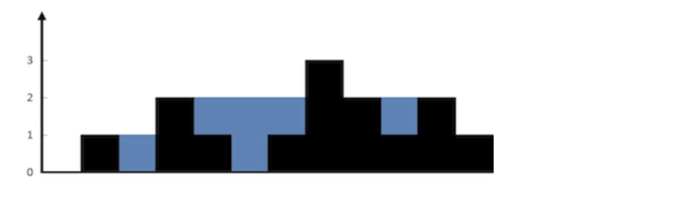

### **[42.  接雨水](https://leetcode.cn/problems/trapping-rain-water/)**

`难度：困难`  

给定  `n`  个非负整数表示每个宽度为  `1`  的柱子的高度图，计算按此排列的柱子，下雨之后能接多少雨水。



- 示例 1

```go
输入：height = [0,1,0,2,1,0,1,3,2,1,2,1]
输出：6
解释：上面是由数组 [0,1,0,2,1,0,1,3,2,1,2,1] 表示的高度图，在这种情况下，可以接 6 个单位的雨水（蓝色部分表示雨水）。
```

- 示例 2

```go
输入：height = [4,2,0,3,2,5]
输出：9
```

- JavaScript [注释]

```js
/**
 * @param {number[]} height
 * @return {number}
 */
var trap = function (height) {
  // ps: 动态规划
  // ps: 思路
  // - 明确就是要求的每个单元雨水 是 Math.min(当前i右边最大的值 ，当前i和左边最大的值 ) - 当前i的高度
  // - 比如：height = [0,1,0,2,1,0,1,3,2,1,2,1]
  // - 求height[2]这一项的雨水是多少 左边最大值为1 右边最大值为3 最小是1  1-0  = 1 所以雨水是1
  // - 求height[5]这一项的雨水是多少 左边最大值为2 右边最大值为3 最小是2  2-0  = 2 所以雨水是2
  // - 以此类推
  // - 我们首先把左边最大的值放在一个数组 右边最大的值放在一个数组，然后做一个循环 当前左边最大值有了 右边最大值有了 当前值有了 然后按上面的累加雨水值 就求出来最后的结果了
  // - 大概思路就这样 过几天我在看 如果还不会在写一遍 
  let n = height.length;
  if (n < 1) return [];
  let leftMax = new Array(n).fill(0);
  let rightMax = new Array(n).fill(0);

  leftMax[0] = height[0];
  for (let i = 1; i < n; i++) {
    leftMax[i] = Math.max(leftMax[i - 1], height[i]);
  }
  rightMax[n - 1] = height[n - 1];
  for (let i = n - 2; i >= 0; i--) {
    rightMax[i] = Math.max(rightMax[i + 1], height[i]);
  }

  let ans = 0;
  for (let i = 1; i < n; i++) {
    ans += Math.min(leftMax[i], rightMax[i]) - height[i];
  }
  return ans;
};
```

- TypeScript

```go
function trap(height: number[]): number {
    let l = 0, r = height.length - 1;
    let lMax = height[l],rMax = height[r];
    let ans = 0;

    while( l < r) {
        if(lMax < rMax) {
            ans += lMax - height[l]
            l++
            lMax = Math.max(lMax,height[l])
        }else {
            ans += rMax - height[r]
            r--
            rMax = Math.max(rMax,height[r])
        }
    }
    return ans
};
```

- Go

```go
func max (a, b int)int {
    if a > b {
        return a
    }
    return b
}

func trap(height []int) int {
    l,r := 0,len(height) - 1
    lMax,rMax := height[l],height[r]
    ans := 0

    for l < r {
        if lMax < rMax {
            ans += lMax - height[l]
            l++
            lMax = max(lMax,height[l])
        } else {
            ans += rMax - height[r]
            r--
            rMax = max(rMax,height[r])
        }
    }
    return ans
}
```
