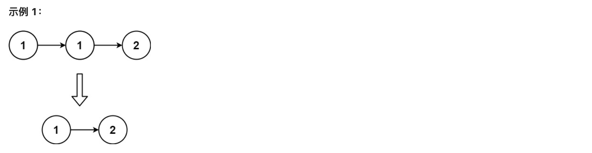

### **[83. 删除排序链表中的重复元素](https://leetcode.cn/problems/remove-duplicates-from-sorted-list/)**

给定一个已排序的链表的头 `head` ， *删除所有重复的元素，使每个元素只出现一次* 。返回 *已排序的链表* 。




```jsx
输入：head = [1,1,2]
输出：[1,2]
```

- js

```jsx
/**
 * Definition for singly-linked list.
 * function ListNode(val, next) {
 *     this.val = (val===undefined ? 0 : val)
 *     this.next = (next===undefined ? null : next)
 * }
 */
/**
 * @param {ListNode} head
 * @return {ListNode}
 */
var deleteDuplicates = function(head) {
   if (!head) return head
    let p = head
    while(p.next){
        if(p.val === p.next.val) {
            p.next = p.next.next
        }else{
            p = p.next
        }
    }
    return head
};

// local
// 输入：head = [1,1,2]
// 输出：[1,2]

function ListNode(val, next) {
  this.val = val === undefined ? 0 : val;
  this.next = next === undefined ? null : next;
}

// 定义测试数据链表1: 1 -> 1 -> 2
const head = new ListNode(1);
head.next = new ListNode(1);
head.next.next = new ListNode(2);
head.next.next.next = new ListNode(2);
head.next.next.next.next = new ListNode(2);

/**
 * @param {ListNode} head
 * @return {ListNode}
 */
var deleteDuplicates = function (head) {
    if(!head) return head
    let p = head
    while(p.next){
        if(p.val === p.next.val){
            p.next = p.next.next
        }else{
            p = p.next
        }
        
    }
    return head
};

console.log(deleteDuplicates(head))
```

- go

```jsx
/**
 * Definition for singly-linked list.
 * type ListNode struct {
 *     Val int
 *     Next *ListNode
 * }
 */
func deleteDuplicates(head *ListNode) *ListNode {
       if head == nil {
           return head
       }

       p := head
       for p.Next!=nil{
           if p.Val == p.Next.Val {
               p.Next = p.Next.Next
           }else {
               p = p.Next
           }
       }
       return head
}

// local
package main

import "fmt"

type ListNode struct {
	Val  int
	Next *ListNode
}

/**
 * Definition for singly-linked list.
 * type ListNode struct {
 *     Val int
 *     Next *ListNode
 * }
 */
func deleteDuplicates(head *ListNode) *ListNode {
	if head == nil {
		return head
	}
	p := head
	for p.Next != nil {
		if p.Val == p.Next.Val {
			p.Next = p.Next.Next
		} else {
			p = p.Next
		}
	}
	return head
}

func main() {
	list := &ListNode{Val: 1}
	list.Next = &ListNode{Val: 1}
	list.Next.Next = &ListNode{Val: 2}

	result := deleteDuplicates(list)

	r := result
	for r != nil {
		fmt.Printf("%d\n", r.Val)
		r = r.Next
	}
}
```