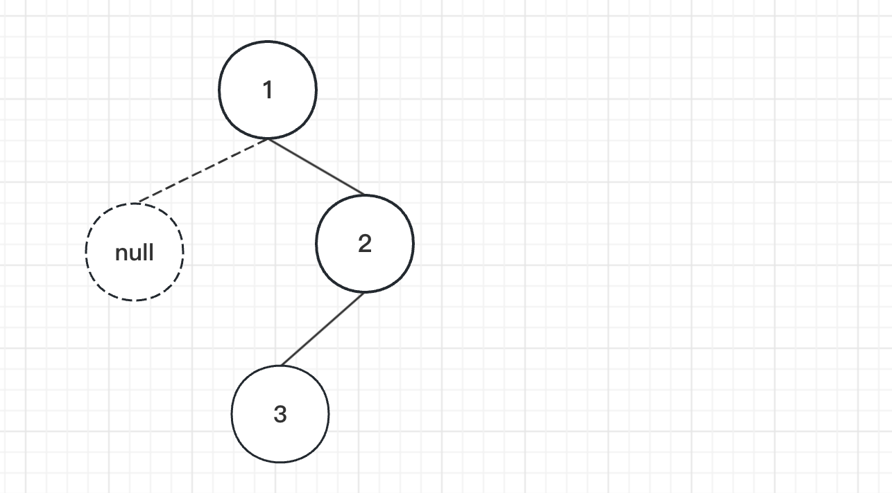

### **[94. 二叉树的中序遍历](https://leetcode.cn/problems/binary-tree-inorder-traversal/)**

`难度：简单`

给定一个二叉树的根节点 `root` ，返回 *它的 **中序** 遍历* 。




```
输入：root = [1,null,2,3]
输出：[1,3,2]
```

- javascript

```go
/**
 * Definition for a binary tree node.
 * function TreeNode(val, left, right) {
 *     this.val = (val===undefined ? 0 : val)
 *     this.left = (left===undefined ? null : left)
 *     this.right = (right===undefined ? null : right)
 * }
 */
/**
 * @param {TreeNode} root
 * @return {number[]}
 */
var inorderTraversal = function(root) {
    let arr = []
    const dfs = (root) =>{
        if(!root) return []
        dfs(root.left)
        arr.push(root.val)
        dfs(root.right)
    }

    dfs(root)
    return arr
};
```

- golang

```go
/**
 * Definition for a binary tree node.
 * type TreeNode struct {
 *     Val int
 *     Left *TreeNode
 *     Right *TreeNode
 * }
 */
func inorderTraversal(root *TreeNode) []int {
     arr := []int{}
     var dfs func(node *TreeNode)
     dfs = func(node *TreeNode) {
         if node !=nil {
             dfs(node.Left)
             arr = append(arr,node.Val)
             dfs(node.Right)
         }
     }
     dfs(root)
     return arr
}
```
