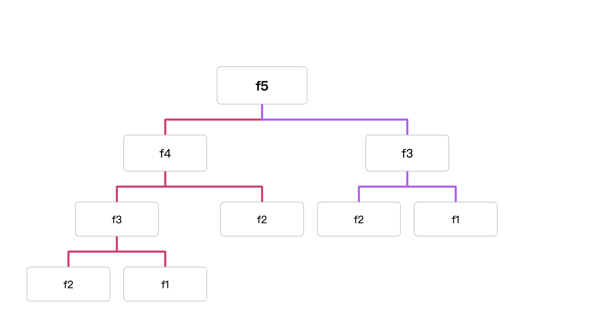

# data-structure-and-algorithms

### 爬楼梯

- **[70. Climbing Stairs](https://leetcode.cn/problems/climbing-stairs/)**

假设你正在爬楼梯。需要 `n` 阶你才能到达楼顶。

每次你可以爬 `1` 或 `2` 个台阶。你有多少种不同的方法可以爬到楼顶呢？

| n步数到顶层 | 先走一步 | 先走两步 | 共多少种 | 总结 |
| --- | --- | --- | --- | --- |
| 1 | 1 | 0 | 1 | if f(1) return 1 |
| 2 | 1+1 | 2 | 2 | if f(2) return 2 |
| 3 | 1+1+1，1+2 | 2+1 | 3 | f3=f(3-1)+f(3-2)=3 |
| 4 | 1+1+1+1，1+1+2，1+2+1 | 2+1+1，2+2 | 5 | f4=f(4-1)+f(4-2)=5 |
| 5 | 1+1+1+1+1，1+1+1+2，1+1+2+1，1+2+1+1 | 2+1+1+1，2+2+1，2+1+2，1+2+2 | 8 | f5=f(5-1)+f(5-2) = 8 |
| n | f(n-1) | f(n-2) | n | fn=f(n-1)+f(n-2) |

*推导：* `第n步 就等于f(n-1)+f(n-2) ⇒ 假设n=5 ⇒ f(5-1)+f(5-2) ⇒f(4)+f(3) ⇒步数为4层的有5种办法+步数为3层的有3种办法 ⇒ 5+3 ⇒ 8 ⇒ 如果5步可以到达顶层有8种不同的方法`



#### 递归

- js

```jsx
/**
 * 递归
 * @param {number} n
 * @return {number}
 */
var climbStairs = function (n) {
  if (n === 1) return 1;
  if (n === 2) return 2;

  return climbStairs(n - 1) + climbStairs(n - 2);
};

console.log(climbStairs(5));
```

如果数值过大，递归会消耗大量的时间，会有超时问题

#### 递归+map

- js

```jsx
/**
 * 递归+map
 * @param {number} n
 * @return {number}
 */
var climbStairs = function (n) {
    const map = new Map();
    const func = (n) =>{
        if (n === 1) return 1;
        if (n === 2) return 2;
        if(map.get(n)){
            return map.get(n)
        }else{
            const result = func(n-1)+func(n-2)
            map.set(n,result)
            return result
        }
    }
    return func(n)
  };
```

- go

```go
func climbStairs(n int) int {
     m := map[int]int{}

     var sum func(n int) int
     sum = func (n int) int{
         if n ==1 {
             return 1
         }
         if n ==2 {
             return 2
         }
         if val,ok := m[n]; ok{
             return val
         }else{
             result := sum(n-1)+sum(n-2)
             m[n] = result
             return result
         }
     }
     return sum(n)
}
```

#### 循环

- js

```jsx
/**
 * 循环
 * @param {number} n
 * @return {number}
 */
var climbStairs = function (n) {
  if (n === 1) return 1;
  if (n === 2) return 2;
  let result = 0;
  let n1 = 1;
  let n2 = 2;

  for (let i = 3; i <= n; i++) {
    result = n1 + n2;
    n1 = n2;
    n2 = result;
  }
  return result;
};
console.log(climbStairs(5));
```

- go

```go
func climbStairs(n int) int {
    if n==1 {
        return 1
    }
    if n==2 {
        return 2
    }
    result := 0
    n1 :=1
    n2 :=2
    for i :=3; i<=n;i++ {
        result = n1+n2
        n1 = n2
        n2 = result
    }
    return result
}
```


### **[1. 两数之和](https://leetcode.cn/problems/two-sum/)**

给定一个整数数组 `nums` 和一个整数目标值 `target`，请你在该数组中找出 **和为目标值** *`target`*  的那 **两个** 整数，并返回它们的数组下标。v

- 示例

```go
输入：nums = [2,7,11,15], target = 9
输出：[0,1]
解释：因为 nums[0] + nums[1] == 9 ，返回 [0, 1] 。
```

求解

- js

```jsx
/**
 * 暴力求解
 * @param {number[]} nums
 * @param {number} target
 * @return {number[]}
 */
var twoSum = function(nums, target) {
    for(let i=0;i<nums.length;i++){
        for(let j=i+1;j<nums.length;j++){
            if(nums[i]+nums[j] === target){
                return [i,j]
            }
        }
    }
};
console.log(twoSum([3,2,4],6));

/**
 * 使用map
 * @param {number[]} nums
 * @param {number} target
 * @return {number[]}
 */
var twoSum = function(nums, target) {
    let map = new Map();
    for(let i=0;i<nums.length;i++){
        let current = target - nums[i];
        if(map.has(current)){
            return [i,map.get(current)]
        }else{
            map.set(nums[i],i)
        }
    }
};
```

- go

```go
package main

import "fmt"

// 暴力求值
func twoSum(nums []int, target int) []int {
	for i := 0; i < len(nums); i++ {
		for j := i + 1; j < len(nums); j++ {
			if nums[i]+nums[j] == target {
				return []int{i, j}
			}
		}
	}
	return []int{}
}

// map求值
func twoSum2(nums []int, target int) []int {
	m := map[int]int{}
	for i := 0; i < len(nums); i++ {
		r := target - nums[i]
		if val, ok := m[r]; ok {
			return []int{i, val}
		} else {
			m[nums[i]] = i
		}
	}
	return []int{}
}

func main() {
	fmt.Println(twoSum2([]int{2, 7, 11, 15}, 9))
}
```

### **[88. 合并两个有序数组](https://leetcode.cn/problems/merge-sorted-array/)**

给你两个按 **非递减顺序** 排列的整数数组 `nums1` 和 `nums2`，另有两个整数 `m` 和 `n` ，分别表示 `nums1` 和 `nums2` 中的元素数目。

请你 **合并** `nums2` w到 `nums1` 中，使合并后的数组同样按 **非递减顺序** 排列。

注意：最终，合并后数组不应由函数返回，而是存储在数组 `nums1` 中。为了应对这种情况，`nums1` 的初始长度为 `m + n`，其中前 `m` 个元素表示应合并的元素，后 `n` 个元素为 `0` ，应忽略。`nums2` 的长度为 `n` 。

- 示例1

```jsx
输入：nums1 = [1,2,3,0,0,0], m = 3, nums2 = [2,5,6], n = 3
输出：[1,2,2,3,5,6]
解释：需要合并 [1,2,3] 和 [2,5,6] 。
合并结果是 [1,2,2,3,5,6] ，其中斜体加粗标注的为 nums1 中的元素。
```

- js

```jsx
/**
 * @param {number[]} nums1
 * @param {number} m
 * @param {number[]} nums2
 * @param {number} n
 * @return {void} Do not return anything, modify nums1 in-place instead.
 */
var merge = function(nums1, m, nums2, n) {
    let i = m-1;
    let j = n-1;
    let k = m+n-1;
    while(i>=0 && j>=0){
        if(nums1[i]>nums2[j]){
            nums1[k] = nums1[i]
            i--;
        }else{
            nums1[k] = nums2[j]
            j--;
        }
        k--;
    }
    while(j>=0){
        nums1[k] = nums2[j]
        j--;
        k--;
    }

   return nums1
};
```

- go

```go
func merge(nums1 []int, m int, nums2 []int, n int)  {
    i := m-1;
    j := n-1;
    k := m+n-1;
    for i>=0&&j>=0 {
        if nums1[i] > nums2[j] {
            nums1[k] = nums1[i]
            i--;
        }else{
            nums1[k] = nums2[j]
            j--
        }
        k--;
    }

    for j>=0{
        nums1[k] = nums2[j]
        j--
        k--
    }
}
```

### **[283. 移动零](https://leetcode.cn/problems/move-zeroes/)**

给定一个数组 `nums`，编写一个函数将所有 `0` 移动到数组的末尾，同时保持非零元素的相对顺序。

**请注意** ，必须在不复制数组的情况下原地对数组进行操作。

- 示例

```go
输入: nums = [0,1,0,3,12]
输出: [1,3,12,0,0]
```

- js

```jsx
/**
 * @param {number[]} nums
 * @return {void} Do not return anything, modify nums in-place instead.
 */
var moveZeroes = function(nums) {
    let i = 0; 
    let j = 0;
    while(i< nums.length){
        j=i;
        if(nums[i] === 0){
              i++;
        }else{
            let k = i;
            while(j>0){
               let pre = nums[j-1]
               if(pre ===0){
                   nums[j-1] = nums[k]
                   nums[k] = pre
               }else{
                   j =0;
               }
               j--
               k--
            }
            i++;
        }
    }
    return nums
};
```

- go

```go
func moveZeroes(nums []int)  {
    i :=0;
    j :=0;
    for i<len(nums){
        j = i;
        if nums[i] ==0 {
            i++
        }else{
            k := i;
            for j>0{
                pre := nums[j-1]
                if pre == 0 {
                    nums[j-1] = nums[k]
                    nums[k] = pre
                }else{
                    j=0
                }
                j--
                k--
            }
            i++
        }
    }
}
```

### **[448. 找到所有数组中消失的数字](https://leetcode.cn/problems/find-all-numbers-disappeared-in-an-array/)**

给你一个含 `n` 个整数的数组 `nums` ，其中 `nums[i]` 在区间 `[1, n]` 内。请你找出所有在 `[1, n]` 范围内但没有出现在 `nums` 中的数字，并以数组的形式返回结果。

- 示例

```jsx
输入：nums = [4,3,2,7,8,2,3,1]
输出：[5,6]
```

- js

```jsx
/**
 * @param {number[]} nums
 * @return {number[]}
 */
var findDisappearedNumbers = function(nums) {
    let arr = [];
    for(let i=1;i<=nums.length;i++){
        if(!nums.includes(i)){
            arr.push(i)
        }
    }
    return arr;
};
```

- go

```jsx
func findDisappearedNumbers(nums []int) []int {
    arr :=[]int{}
    m := make(map[int]bool)
    for _,v := range nums {
        m[v] = true
    }

    for i:=1;i<=len(nums);i++{
        if m[i]!= true {
            arr = append(arr,i)
        }
    }
    return arr
}
```

### **[21. 合并两个有序链表](https://leetcode.cn/problems/merge-two-sorted-lists/)**

将两个升序链表合并为一个新的 **升序** 链表并返回。新链表是通过拼接给定的两个链表的所有节点组成的。


```jsx
输入：l1 = [1,2,4], l2 = [1,3,4]
输出：[1,1,2,3,4,4]
```

- js

```jsx
/**
 * Definition for singly-linked list.
 * function ListNode(val, next) {
 *     this.val = (val===undefined ? 0 : val)
 *     this.next = (next===undefined ? null : next)
 * }
 */
/**
 * @param {ListNode} list1
 * @param {ListNode} list2
 * @return {ListNode}
 */
var mergeTwoLists = function(list1, list2) {
     if (list1 === null && list2 ===null) return list1
     
     const d = new ListNode(0)
     let p = d
     while(list1!==null&&list2!==null){
         if(list1.val < list2.val){
             p.next = list1
             list1 = list1.next
         }else{
             p.next = list2
             list2 = list2.next
         }
         p = p.next
     }

     p.next = list1?list1:list2

     return d.next
};
```

- 通过节点方式实现

```jsx
function ListNode(val, next) {
    this.val = (val === undefined ? 0 : val);
    this.next = (next === undefined ? null : next);
}
// 定义测试数据链表1: 1 -> 2 -> 4
const list1 = new ListNode(1);
list1.next = new ListNode(2);
list1.next.next = new ListNode(4);

// 定义测试数据链表2: 1 -> 3 -> 4
const list2 = new ListNode(1);
list2.next = new ListNode(3);
list2.next.next = new ListNode(4);

/**
 * @param {ListNode} list1
 * @param {ListNode} list2
 * @return {ListNode}
 */
var mergeTwoLists = function(list1, list2) {
    
    if (list1 === nul && list2 === null) return list1

    const dummy = new ListNode(0);
    let p = dummy;

    while(list1!==null&&list2!==null){
        if(list1.val < list2.val){
            p.next = list1;
            list1 = list1.next
        }else{
           p.next = list2;
           list2 = list2.next
        }
        p = p.next
    }

    p.next = list1?list1:list2
    return dummy.next
};
```

- 通过对象的方式实现

```jsx
let l1 = {
    val:1,
    next:{
        val:2,
        next:{
            val:4
        }
    }
}
let l2 = {
    val:1,
    next:{
        val:3,
        next:{
            val:4
        }
    }
}
// 通过对象的方式去实现
var mergeTwoLists2 = function(l1, l2) {
    
    if (l1 === null&&l2 === null) return l1;
    const d = {val:0}
    let p = d
    while (l1 && l2 ) {
        if (l1.val < l2.val) {
            p.next = l1;
            l1 = l1.next;
        } else {
            p.next = l2;
            l2 = l2.next;
        }
        p = p.next;
    }
    p.next = l1 ? l1 : l2
    return d.next
}

console.log(mergeTwoLists2(l1,l2))
```

- go

```jsx
package main

import "fmt"

type ListNode struct {
	Val  int
	Next *ListNode
}

/**
 * Definition for singly-linked list.
 * type ListNode struct {
 *     Val int
 *     Next *ListNode
 * }
 */
func mergeTwoLists(list1 *ListNode, list2 *ListNode) *ListNode {

	if list1 == nil && list2 == nil {
		return list1
	}
	d := &ListNode{Val: 0}
	p := d

	for list1 != nil && list2 != nil {
		if list1.Val < list2.Val {
			p.Next = list1
			list1 = list1.Next
		} else {
			p.Next = list2
			list2 = list2.Next
		}
		p = p.Next
	}

	if list1 != nil {
		p.Next = list1
	}
	if list2 != nil {
		p.Next = list2
	}
	return d.Next
}

func main() {
	// Linked list 1: 1 -> 2 -> 4
	list1 := &ListNode{Val: 1}
	list1.Next = &ListNode{Val: 2}
	list1.Next.Next = &ListNode{Val: 4}

	// Linked list 2: 1 -> 3 -> 4
	list2 := &ListNode{Val: 1}
	list2.Next = &ListNode{Val: 3}
	list2.Next.Next = &ListNode{Val: 4}

	result := mergeTwoLists(list1, list2)

	p := result

	for p != nil {
		fmt.Printf("%d ", p.Val)
		p = p.Next
	}
}
```

### **[83. 删除排序链表中的重复元素](https://leetcode.cn/problems/remove-duplicates-from-sorted-list/)**

给定一个已排序的链表的头 `head` ， *删除所有重复的元素，使每个元素只出现一次* 。返回 *已排序的链表* 。


```jsx
输入：head = [1,1,2]
输出：[1,2]
```

- js

```jsx
/**
 * Definition for singly-linked list.
 * function ListNode(val, next) {
 *     this.val = (val===undefined ? 0 : val)
 *     this.next = (next===undefined ? null : next)
 * }
 */
/**
 * @param {ListNode} head
 * @return {ListNode}
 */
var deleteDuplicates = function(head) {
   if (!head) return head
    let p = head
    while(p.next){
        if(p.val === p.next.val) {
            p.next = p.next.next
        }else{
            p = p.next
        }
    }
    return head
};

// local
// 输入：head = [1,1,2]
// 输出：[1,2]

function ListNode(val, next) {
  this.val = val === undefined ? 0 : val;
  this.next = next === undefined ? null : next;
}

// 定义测试数据链表1: 1 -> 1 -> 2
const head = new ListNode(1);
head.next = new ListNode(1);
head.next.next = new ListNode(2);
head.next.next.next = new ListNode(2);
head.next.next.next.next = new ListNode(2);

/**
 * @param {ListNode} head
 * @return {ListNode}
 */
var deleteDuplicates = function (head) {
    if(!head) return head
    let p = head
    while(p.next){
        if(p.val === p.next.val){
            p.next = p.next.next
        }else{
            p = p.next
        }
        
    }
    return head
};

console.log(deleteDuplicates(head))
```

- go

```jsx
/**
 * Definition for singly-linked list.
 * type ListNode struct {
 *     Val int
 *     Next *ListNode
 * }
 */
func deleteDuplicates(head *ListNode) *ListNode {
       if head == nil {
           return head
       }

       p := head
       for p.Next!=nil{
           if p.Val == p.Next.Val {
               p.Next = p.Next.Next
           }else {
               p = p.Next
           }
       }
       return head
}

// local
package main

import "fmt"

type ListNode struct {
	Val  int
	Next *ListNode
}

/**
 * Definition for singly-linked list.
 * type ListNode struct {
 *     Val int
 *     Next *ListNode
 * }
 */
func deleteDuplicates(head *ListNode) *ListNode {
	if head == nil {
		return head
	}
	p := head
	for p.Next != nil {
		if p.Val == p.Next.Val {
			p.Next = p.Next.Next
		} else {
			p = p.Next
		}
	}
	return head
}

func main() {
	list := &ListNode{Val: 1}
	list.Next = &ListNode{Val: 1}
	list.Next.Next = &ListNode{Val: 2}

	result := deleteDuplicates(list)

	r := result
	for r != nil {
		fmt.Printf("%d\n", r.Val)
		r = r.Next
	}
}
```

### **[141. 环形链表](https://leetcode.cn/problems/linked-list-cycle/)**

给你一个链表的头节点 `head` ，判断链表中是否有环。

如果链表中有某个节点，可以通过连续跟踪 `next` 指针再次到达，则链表中存在环。 为了表示给定链表中的环，评测系统内部使用整数 `pos` 来表示链表尾连接到链表中的位置（索引从 0 开始）。**注意：`pos` 不作为参数进行传递** 。仅仅是为了标识链表的实际情况。

*如果链表中存在环* ，则返回 `true` 。 否则，返回 `false` 。


```jsx
输入：head = [3,2,0,-4], pos = 1
输出：true
解释：链表中有一个环，其尾部连接到第二个节点。
```

- go

```jsx
/**
 * Definition for singly-linked list.
 * type ListNode struct {
 *     Val int
 *     Next *ListNode
 * }
 */
func hasCycle(head *ListNode) bool {
      a := head
      b := head
      
      for b!=nil && b.Next!=nil {
          a = a.Next
          b = b.Next.Next
          if a == b {
              return true
          }
      }
      return false
}
```

- js

```jsx
/**
 * Definition for singly-linked list.
 * function ListNode(val) {
 *     this.val = val;
 *     this.next = null;
 * }
 */

/**
 * @param {ListNode} head
 * @return {boolean}
 */
var hasCycle = function(head) {
    let a = head,b = head;
    
    while(b!==null && b.next!==null){
        a = a.next
        b = b.next.next
        if (a === b) return true
    }
    return false
};
```


### **[142. 环形链表 II](https://leetcode.cn/problems/linked-list-cycle-ii/)**

给定一个链表的头节点  `head` ，返回链表开始入环的第一个节点。 *如果链表无环，则返回 `null`。*

如果链表中有某个节点，可以通过连续跟踪 `next` 指针再次到达，则链表中存在环。 为了表示给定链表中的环，评测系统内部使用整数 `pos` 来表示链表尾连接到链表中的位置（**索引从 0 开始**）。如果 `pos` 是 `-1`，则在该链表中没有环。**注意：`pos` 不作为参数进行传递**，仅仅是为了标识链表的实际情况。

**不允许修改** 链表。


```jsx
输入：head = [3,2,0,-4], pos = 1
输出：返回索引为 1 的链表节点
解释：链表中有一个环，其尾部连接到第二个节点。
```

- js

```jsx
function ListNode(val) {
  this.val = val;
  this.next = null;
}
/**
 * @param {ListNode} head
 * @return {ListNode}
 */
var detectCycle = function (head) {
   
    // let p = head
    s = new Set()
    while(head!=null){
      if(s.has(head)){
        return head
      }
      s.add(head)
      head = head.next
    }

    return null
};

const list = new ListNode(3);
list.next = new ListNode(2);
list.next.next = new ListNode(0);
list.next.next.next = new ListNode(-4);
list.next.next.next.next = list.next
console.log(detectCycle(list))
```

- go

```go
package main

import "fmt"

type ListNode struct {
	Val  int
	Next *ListNode
}

func detectCycle(head *ListNode) *ListNode {

	m := make(map[*ListNode]bool)

	for head != nil {
		if _, ok := m[head]; ok {
			return head
		}
		m[head] = true
		head = head.Next
	}
	return nil
}

func main() {
	list := &ListNode{Val: 3}
	list.Next = &ListNode{Val: 2}
	list.Next.Next = &ListNode{Val: 0}
	list.Next.Next.Next = &ListNode{Val: -4}
	list.Next.Next.Next.Next = list.Next
	res := detectCycle(list)
	fmt.Printf("res:=%v", res.Val)
}
```

### **[160. 相交链表](https://leetcode.cn/problems/intersection-of-two-linked-lists/)**

给你两个单链表的头节点 `headA` 和 `headB` ，请你找出并返回两个单链表相交的起始节点。如果两个链表不存在相交节点，返回 `null` 。


```go
输入：intersectVal = 8, listA = [4,1,8,4,5], listB = [5,6,1,8,4,5], skipA = 2, skipB = 3
输出：Intersected at '8'
解释：相交节点的值为 8 （注意，如果两个链表相交则不能为 0）。
从各自的表头开始算起，链表 A 为 [4,1,8,4,5]，链表 B 为 [5,6,1,8,4,5]。
在 A 中，相交节点前有 2 个节点；在 B 中，相交节点前有 3 个节点。
— 请注意相交节点的值不为 1，因为在链表 A 和链表 B 之中值为 1 的节点 (A 中第二个节点和 B 中第三个节点) 是不同的节点。换句话说，它们在内存中指向两个不同的位置，而链表 A 和链表 B 中值为 8 的节点 (A 中第三个节点，B 中第四个节点) 在内存中指向相同的位置。
```

- js

```jsx
/**
 * 输入：intersectVal = 8, listA = [4,1,8,4,5], listB = [5,6,1,8,4,5], skipA = 2, skipB = 3
   输出：Intersected at '8'
 * Definition for singly-linked list.
 * function ListNode(val) {
 *     this.val = val;
 *     this.next = null;
 * }
 */
function ListNode(val) {
  this.val = val;
  this.next = null;
}
/**
 * @param {ListNode} headA
 * @param {ListNode} headB
 * @return {ListNode}
 */
var getIntersectionNode = function (headA, headB) {
    
    console.log(headA, headB)
    let nodeSet = new Set()
    while(headA !=null){
        nodeSet.add(headA)
        headA = headA.next
    }

    console.log(nodeSet)
    while(headB !=null){
        if(nodeSet.has(headB)){
            return headB
        }
        headB = headB.next
    }

};

l3 = new ListNode(8)
l3.next = new ListNode(4)
l3.next.next = new ListNode(5)

l1 = new ListNode(4)
l1.next = new ListNode(1)
l1.next.next = l3
l1.next.next.next = l3.next
l1.next.next.next.next = l3.next.next
l2  = new ListNode(5)
l2.next  = new ListNode(6)
l2.next.next  = new ListNode(1)
l2.next.next.next  = l3
l2.next.next.next.next  = l3.next
l2.next.next.next.next.next  =l3.next.next
console.log(getIntersectionNode(l1,l2))
```

- go

```go
package main

import "fmt"

type ListNode struct {
	Val  int
	Next *ListNode
}

/**
 * Definition for singly-linked list.
 * type ListNode struct {
 *     Val int
 *     Next *ListNode
 * }
 */
func getIntersectionNode(headA, headB *ListNode) *ListNode {

	nodeSet := make(map[*ListNode]bool)

	for headA != nil {
		nodeSet[headA] = true
		headA = headA.Next
	}

	for headB != nil {
		if _, ok := nodeSet[headB]; ok {
			return headB
		}
		headB = headB.Next
	}

	return nil

}

func main() {
	l3 := &ListNode{Val: 8}
	l3.Next = &ListNode{Val: 4}
	l3.Next.Next = &ListNode{Val: 5}

	l1 := &ListNode{Val: 4}
	l1.Next = &ListNode{Val: 1}
	l1.Next.Next = l3
	l1.Next.Next.Next = l3.Next
	l1.Next.Next.Next.Next = l3.Next.Next

	l2 := &ListNode{Val: 5}
	l2.Next = &ListNode{Val: 6}
	l2.Next.Next = &ListNode{Val: 1}
	l2.Next.Next.Next = l3
	l2.Next.Next.Next.Next = l3.Next
	l2.Next.Next.Next.Next.Next = l3.Next.Next

	res := getIntersectionNode(l1, l2)
	fmt.Println(res.Val)
}
```