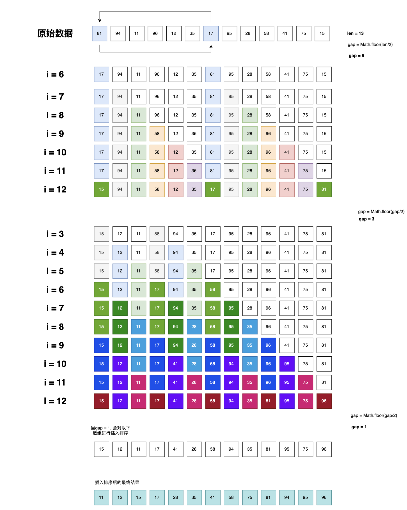

### 希尔排序【shellSort】

希尔排序是对插入排序的一种改进，简单来说就是把当前数组按 gap 间隔值，分成若干个子序列，然后对若干个子序列进行插入排序，然后在对 gap 间隔值进行缩减，直到为 1，然后进行插入排序，这个时候元素之前的位置以达到最优，需要注意的是，间隔排序是按 gap 间隔值和当前值减去间隔值进行排序，并不是紧按着的两个元素进行排序，理解上可能有点费劲。耐心看。下面是具体的实现代码和参考的插图，作为理解。



**JavaScript 代码**

```jsx
const shellSort = (arr) => {
  let len = arr.length;

  let gap = Math.floor(len / 2);

  while (gap >= 1) {
    for (let i = gap; i < len; i++) {
      let item = arr[i];
      let j = i;
      while (arr[j - gap] > item && j > gap - 1) {
        arr[j] = arr[j - gap];
        j -= gap;
      }
      arr[j] = item;
    }
    gap = Math.floor(gap / 2);
  }
  return arr;
};

let arr = [81, 94, 11, 96, 12, 35, 17, 95, 28, 58, 41, 75, 15];
console.log(shellSort(arr));
```

**Go 代码**

```go
package main

import "fmt"

func shellSort(arr []int) []int {
	leg := len(arr)
	gap := leg / 2

	for gap >= 1 {
		for i := gap; i < leg; i++ {
			item := arr[i]
			j := i

			for j > gap-1 && arr[j-gap] > item {
				arr[j] = arr[j-gap]
				j -= gap
			}
			arr[j] = item
		}
		gap = gap / 2
	}
	return arr
}
func main() {
	res := shellSort([]int{81, 94, 11, 96, 12, 35, 17, 95, 28, 58, 41, 75, 15})
	fmt.Println(res)
}
```
